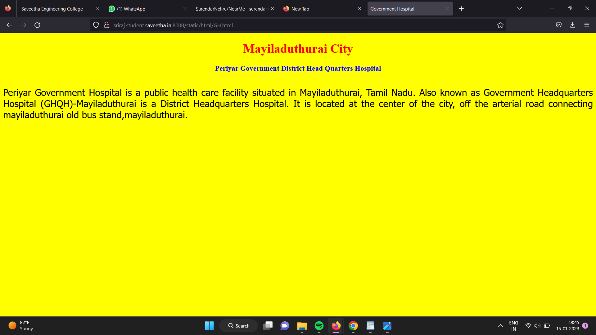

# Places Around Me
## AIM:
To develop a website to display details about the places around my house.

## Design Steps:

### Step 1:
clone the github repository into Theia IDE.

### Step 2:
create a new django project 

### Step 3:
Write the needed HTML code.

### Step 4:
Run the django server and execute the HTML files.

## Code:
```
map.html
<!DOCTYPE html>
<html lang="en">
<head>
<title>My City</title>
</head>
<body>
<h1 align="center">
<font color="red"><b>Mayiladuthurai City</b></font>
</h1>
<h3 align="center">
<font color="blue"><b>SRIRAJ G (22004175)</b></font>
</h3>
<center>

<map name="MyCity">
<area shape="circle" coords="190,50,20" href="/static/html/Hotel.html" title="Hotel Pams">
<area shape="rectangle" coords="230,30,260,60" href="/static/html/GH.html" title="Periyar Government District Head Quarters Hospital">
<area shape="circle" coords="400,350,50" href="/static/html/bus.html" title="Mayiladuthurai Old Bus Stand">
<area shape="circle" coords="400,200,75" href="/static/html/SuperMarket.html" title="Paalam SuperMarket">
<area shape="rectangle" coords="490,150,870,320" href="/static/html/GGSMM.html" title="Guru Gnana Sambandar Mission Matriculation Higher Secondary School">
</map>
</center>
</body>
</html>

bus.html
<!DOCTYPE html>
<html lang="en">
<head>
<title>Bus Stand</title>
</head>
<body bgcolor="cyan">
<h1 align="center">
<font color="red"><b>Mayiladuthurai City </b></font>
</h1>
<h3 align="center">
<font color="blue"><b>Mayiladuthurai Old Bus Stand</b></font>
</h3>
<hr size="3" color="red">
<p align="justify">
<font face="Courier New" size="5">
<b>
Mayiladuthurai (formerly known as Mayavaram or Mayuram) is a town and district headquarter of Mayiladuthurai district in Tamil Nadu, India. The town is located at a distance of 281 km (175 mi) from the state capital, Chennai.
Mayiladuthurai was ruled by Medieval Cholas and subsequently ruled by various dynasties, including the Vijayanagar Empire, Thanjavur Nayaks, Thanjavur Marathas and the British Empire. Mayiladuthurai was a part of the erstwhile Tanjore district until India's independence in 1947 and Thanjavur district until 1991 and subsequently a part of the newly formed Nagapattinam district. The town is known for agriculture, and weaving. As Mayiladuthurai is situated in East Coast, fishing plays an vital role on generating it's revenue.
Mayiladuthurai is administered by a town panchayat established in 1866. As of 2008, the panchayat covered an area of 11.27 km2 (4.35 sq mi). Mayiladuthurai comes under the Mayiladuthurai assembly constituency which elects a member to the Tamil Nadu Legislative Assembly once every five years and it is a part of the Mayiladuthurai constituency which elects its Member of Parliament (MP) once in five years. It is well connected by road and rail transport. Mayiladuthurai serves as an important junction in main line connecting Chennai with Trichy. Roadways and Railways are the major mode of transportation to the town. The nearest airport, Pondicherry Airport, is located 116 km (72 mi) from the town.
Mayiladuthurai was carved out of Nagapattinam district and inaugurated as the 38th district of Tamil Nadu on December 28, 2020
</b>
</font>
</p>
</body>
</html>

GGSMM.html
<!DOCTYPE html>
<html lang="en">
<head>
<title>G.G.S.M.M.HR.SEC.SCHOOL</title>
</head>
<body bgcolor="lime">
<h1 align="center">
<font color="red"><b>Mayiladuthurai City</b></font>
</h1>
<h3 align="center">
<font color="blue">Guru Gnana Sambandar Mission Matriculation Higher Secondary School<b></b></font>
</h3>
<hr size="3" color="red">
<p align="justify">
<font face="Georgia" size="5">
The main objectives of   Guru Gnana Sambandar Mission Matriculation Higher Secondary School are
<ul>
<li>To impart proper and qualified training to teachers and give them an attractive salary and incentives so that they are not tempted to quit and look elsewhere for jobs.</li>
<li>To provide financial aids and grants wisely and judiciously.</li>
<li>To Frame of syllabus and curriculum.</li>
<li>To set aims and objectives of education.</li>
</ul>
</font>
</p>
</body>
</html>

GH.html
<!DOCTYPE html>
<html lang="en">
<head>
<title>Government Hospital</title>
</head>
<body bgcolor="yellow">
<h1 align="center">
<font color="red"><b>Mayiladuthurai City</b></font>
</h1>
<h3 align="center">
<font color="blue"><b>Periyar Government District Head Quarters Hospital</b></font>
</h3>
<hr size="3" color="red">
<p align="justify">
<font face="Tahoma" size="5">
Periyar Government Hospital is a public health care facility situated in Mayiladuthurai, Tamil Nadu. Also known as Government Headquarters Hospital (GHQH)-Mayiladuthurai is a District Headquarters Hospital. It is located at the center of the city, off the arterial road connecting mayiladuthurai old bus stand,mayiladuthurai.
</font>
</p>
</body>
</html>

Hotel.html
<!DOCTYPE html>
<html lang="en">
<head>
<title>Hotel</title>
</head>
<body bgcolor="pink">
<h1 align="center">
<font color="red"><b>Mayiladuthurai City</b></font>
</h1>
<h3 align="center">
<font color="blue">Hotel Pams<b></b></font>
</h3>
<hr size="3" color="red">
<p align="justify">
<font face="Arial" size="5">
<b>
Hotel PAMS is a business class hotel.This hotel located just opposite the old bus stand. HOTEL PAMS is the leading hotel a Mayiladuthurai and they have been in service since 1999. HOTEL PAMS aim is to provide our guests with the best service possible and to make their stay a comfortable and memorable one with our personalized service with a homely touch. 
</b>
</font>
</p>
</body>
</html>

SuperMarket.html
<!DOCTYPE html>
<html lang="en">
<head>
<title>SuperMarket</title>
</head>
<body bgcolor="orange">
<h1 align="center">
<font color="red"><b>Mayiladuthurai City</b></font>
</h1>
<h3 align="center">
<font color="blue"><b>Paalam SuperMarket</b></font>
</h3>
<hr size="3" color="red">
<p align="justify">
<font face="Georgia" size="5">
The uses of Paalam SuperMarket in Mayiladuthurai District are 
<ol type="1">
<li>It is used for purchasing snakcs.</li>
<li>It is used for purchasing vegetables and Fruits.</li>
<li>It is used for purchasing need of a man.</li>
<li>Freedom of selection.</li>
</ol>
</font>
</p>
</body>
</html>
```

## Output:





## HTML Validator


## Result:
The program for implementing image map is executed successfully